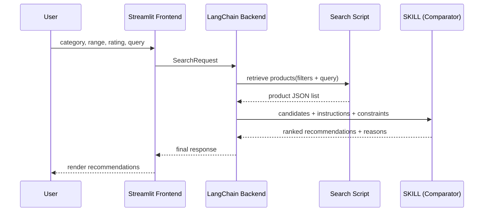

Perfect — this flow is clear and good for a hackathon.

## Updated Architecture Summary (based on your correct flow)

### End-to-end flow
1. **User (Streamlit UI)** provides:
   - category
   - price range
   - min ratings
   - search query
2. **Frontend → Backend**: sends structured request.
3. **LangChain Backend**:
   - calls **search script** first (deterministic retrieval)
   - gets product JSON results
   - then calls **SKILL** with those results
4. **SKILL**:
   - compares/ranks products using defined instructions
   - returns curated recommendations + rationale
5. **Backend → Frontend**:
   - sends final response for rendering in Streamlit.

---

## Why this order is strong
- Keeps retrieval deterministic (search script first).
- Uses SKILL for reasoning/comparison only (more reliable).
- Easier to debug: “bad retrieval” vs “bad ranking” are separable.

---

## Component interaction contract (recommended)

### 1) UI to backend
```json
{
  "query": "running shoes",
  "category": "footwear",
  "price_min": 50,
  "price_max": 120,
  "min_rating": 4.0
}
```

### 2) Backend to search script
```json
{
  "query": "running shoes",
  "filters": {
    "category": "footwear",
    "price_min": 50,
    "price_max": 120,
    "min_rating": 4.0
  },
  "limit": 20
}
```

### 3) Search script output
```json
{
  "products": [
    {
      "id": "sku_101",
      "name": "Nike Revolution 7",
      "price": 89.99,
      "rating": 4.3,
      "brand": "Nike",
      "source": "catalog",
      "url": "https://example.com/sku_101"
    }
  ]
}
```

### 4) Backend to SKILL
```json
{
  "user_intent": "Find best value running shoes",
  "constraints": {
    "category": "footwear",
    "price_min": 50,
    "price_max": 120,
    "min_rating": 4.0
  },
  "candidates": [ ...products ]
}
```

### 5) SKILL output to backend
```json
{
  "recommended": [
    {
      "id": "sku_101",
      "score": 0.91,
      "reason": "Best rating-to-price ratio within budget"
    }
  ],
  "comparison_summary": "Top picks balance cushioning, rating, and cost."
}
```

### 6) Backend final response to Streamlit
```json
{
  "results": [ ...enriched recommended products... ],
  "summary": "Top 5 matches in footwear between $50-$120 with rating >= 4.0",
  "applied_filters": { ... },
  "errors": null
}
```

---

## Sequence diagram (final)



---

## Practical feasibility note
This is **absolutely feasible in 3 hours** if you:
- keep only **one skill** (comparison/ranking),
- use **strict JSON schemas** at every handoff,
- return **top 5 results** only,
- add fallback: if SKILL fails, show search results directly.

If you want, I can now give you a **ready-to-paste `README.md` architecture section** exactly matching this flow.
