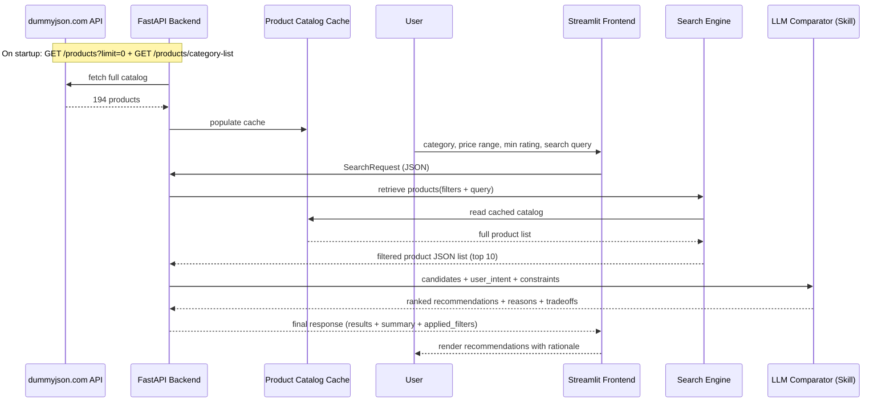

# AI Shopping Decision Assistant — Architecture & Technical Design

> Maps to 10 evaluation criteria from the problem statement.
> Each section header cites the criterion it satisfies.
> **Data source: [dummyjson.com/docs/products](https://dummyjson.com/docs/products)** — 194 real (fake-store) product SKUs across 24 categories, fetched once at startup and cached locally.

---

## 1. Problem Understanding, Approach & Innovation

### Problem Statement

Online shoppers face three core pain points when evaluating products:

1. **Choice overload** — dozens or hundreds of near-identical SKUs with subtle tradeoffs
2. **Inconsistent information quality** — reviews, specs, and prices live across sources; no unified comparison
3. **Lack of explainable reasoning** — recommendation engines are black boxes; users can't verify *why* one product wins

### User Needs & Assumptions

| Need | Assumption |
| --- | --- |
| Filter products by category, budget, and rating | A structured product catalog exists — satisfied by dummyjson's live API (194 SKUs, 24 categories, no auth required) |
| See pros/cons per product | Rich per-product fields (rating, stock, discount, warranty, return policy, reviews) are available to reason over |
| Receive a ranked recommendation with rationale | An LLM can synthesize comparison logic from product data |
| Ask follow-up questions ("which is best for wide feet?") | The assistant retains conversation context |

### Approach

The system follows a **deterministic retrieval + LLM reasoning** pipeline:

1. At startup, the backend pulls the **entire dummyjson catalog** (`GET /products?limit=0`) and caches it locally — 194 items is small enough to hold in memory, and dummyjson doesn't support the combined price+rating+category filtering the UI needs, so filtering has to happen on our side anyway.
2. A search layer performs **structured, filter-first retrieval** against the cached catalog — category, price range, min rating, and full-text query.
3. The top-K candidates (K=10) are passed to an **LLM comparator skill** that ranks, explains tradeoffs, and emits a final recommendation.
4. The UI renders both the structured results and the LLM-generated rationale.

### Innovative Aspects

- **Separation of retrieval and reasoning**: retrieval is deterministic and auditable; LLM reasoning is isolated to comparison logic, making it easy to swap models or improve prompts without touching search.
- **Explainable by design**: every recommendation carries a structured rationale field, not just a score.
- **Graceful fallback**: if the LLM comparator fails, raw search results are still displayed — zero degraded-user experience.
- **LLM-as-a-service skill pattern**: the comparator is a self-contained module with a strict JSON contract, enabling reuse across different frontends (web, mobile, CLI).
- **Real (if synthetic-store) data, zero data-entry effort**: using dummyjson instead of hand-authored fixtures means the demo runs on genuinely varied prices, ratings, stock levels, and review text — no one has to invent a plausible catalog.

---

## 2. Prompt Engineering & LLM Utilization

### Comparator Skill Prompt Design

The LLM comparator is invoked with a structured prompt containing three sections:

**System prompt (static):**

```
You are a product comparison expert. Your job is to evaluate a list of candidate
products against the user's stated intent and constraints, rank them, and provide
clear, honest pros/cons with a final recommendation.

Rules:
- Base every claim on data provided; do not invent specs.
- If two products are close, say so and explain the tiebreaker.
- Flag any product that violates a hard constraint (price, min rating) — even if
  it appeared in the candidate list.
- Weigh stock/availability and return policy alongside price and rating — a
  cheaper item that is low-stock or has a short return window is a real tradeoff,
  not a strictly better pick.
- Output strictly valid JSON matching the provided schema.
- Keep the comparison_summary to 2-3 sentences; keep each reason under 40 words.
```

**User prompt (dynamic, per request):**

```
User intent: "{user_query}"

Hard constraints:
  - Category: {category}
  - Price range: ${price_min} – ${price_max}
  - Minimum rating: {min_rating}

Candidates (JSON array, fields sourced from dummyjson):
{candidates_json}

Respond with:
{
  "recommended": [ { "id": "...", "score": 0.0-1.0, "reason": "...", "tradeoffs": "..." } ],
  "comparison_summary": "..."
}
```

`candidates_json` is a trimmed projection of the cached dummyjson record — `title`, `price`, `rating`, `brand`, `discountPercentage`, `stock`, `availabilityStatus`, `warrantyInformation`, `returnPolicy`, and up to 2 review comments (text only — see the PII note in Section 8 on why reviewer names/emails are stripped before this point).

### Prompt Engineering Decisions

| Decision | Rationale |
| --- | --- |
| Few-shot candidates in the prompt (not retrieved via RAG) | Guarantees the LLM sees exactly the products the search layer found — no drift |
| Strict JSON schema enforced via output parsing | Prevents hallucinated fields; enables downstream validation |
| Negative instructions ("do not invent specs") | Reduces fabrication risk on numeric attributes — matters more now that real dummyjson numbers (price, discount, stock) are in play |
| Explicit tiebreaker instruction | Produces more consistent ranking across runs |
| Stock/return-policy weighting instruction | dummyjson exposes `stock`, `availabilityStatus`, and `returnPolicy` per product — using them turns "pick the top-rated one" into an actual tradeoff comparison |
| Short rationale tokens (<=40 words) | Keeps UI rendering responsive and concise |

### Handling Model Limitations

- **Hallucination guard**: the prompt explicitly forbids inventing specs; output parser validates field presence.
- **Fallback path**: if the LLM returns invalid JSON or times out, the backend returns raw search results without ranking.
- **Context window**: with K=10 candidates, the prompt stays under ~2K tokens — well within any modern model's limit.
- **Model selection**: Claude Opus / Sonnet for quality; fallback to Haiku for cost on high-volume endpoints.

---

## 3. Security, Privacy & Execution Accountability

### Security Layer Overview

The application now wraps the existing LangChain comparator and search flow with a minimal but practical security layer. The goal is not to replace the core reasoning harness, but to isolate user inputs, protect the system from misuse, and preserve decision transparency.

### Privacy Controls

- **Incognito sessions**: only temporary session-scoped data is kept in memory.
- **No long-term profile memory**: names, emails, addresses, and persistent personal preferences are not stored.
- **Data minimization**: the app retains only the minimum session metadata needed for the current workflow.
- **PII stripping**: product reviews are sanitized before they reach prompts or logs.

### Security Controls

- **Input validation**: query, category, price, rating, and limit are validated before invoking the agent stack.
- **Prompt-injection filtering**: user-supplied text is sanitized to reduce override/bypass/security-prompt phrases.
- **Safe path checks**: sensitive filesystem targets such as `.env`, `SKILL.md`, and traversal attempts like `../..` are rejected.
- **Rate limiting**: repeated requests from the same client are limited to prevent abuse.
- **Least privilege design**: existing tool/search modules are reused without granting extra shell/admin capabilities.

### Accountability & Audit Trail

The system records a lightweight non-PII execution trace for each request:

```text
trace_id
session_id
timestamp
status
step
tool/search name
latency
error
product IDs
validation_result
recommendation_result
```

This produces a minimal operational trail without storing chain-of-thought, raw private messages, or API secrets. The audit log answers questions such as:

- What happened during this decision run?
- Which search/tool steps ran?
- Which products were considered?
- Did validation pass or fail?
- What recommendation was returned?

### Recommendation Integrity Guardrails

- Product IDs returned by the LLM must exist in the retrieved candidate list.
- Score values are checked before being accepted.
- Ranking order is checked for validity.
- Budget and minimum-rating constraints are enforced deterministically.
- If the model invents or contradicts authoritative catalog data, the backend rejects or corrects the recommendation and falls back to valid filtered results.

### Reliability & Fallback

- Temporary failures are treated as safe degradation, not silent misinformation.
- If AI comparison fails or times out, the app shows valid product matches rather than fabricating a recommendation.
- This keeps the demo operational and gives a clear user-facing fallback message without harming the underlying product search experience.

---

## 4. Data Modeling & Database Design

### Product Entity (cached from dummyjson)

Rather than inventing a schema, the app keeps the dummyjson record close to its native shape and adds only what it needs on top. This avoids a lossy translation layer and keeps the raw fields (`stock`, `discountPercentage`, `returnPolicy`, etc.) available to the comparator.

```json
{
  "id": 101,
  "title": "Nike Revolution 7",
  "category": "sports-accessories",
  "brand": "Nike",
  "price": 89.99,
  "discountPercentage": 12.5,
  "rating": 4.3,
  "stock": 34,
  "availabilityStatus": "In Stock",
  "warrantyInformation": "3 months warranty",
  "shippingInformation": "Ships in 3-5 business days",
  "returnPolicy": "30 days return policy",
  "tags": ["sports", "shoes"],
  "sku": "RCH45Q1A",
  "reviews": [
    { "rating": 5, "comment": "Very satisfied!" }
  ],
  "thumbnail": "https://dummyjson.com/...",
  "cached_at": "2026-08-12T09:00:00Z"
}
```

Notes vs. the original hand-authored schema:

- `title` replaces `name` (matches dummyjson's actual field — remapped to `name` only in the UI layer, not the cache, to avoid a translation bug class).
- `pros`/`cons` are **not** stored on the catalog entity — dummyjson doesn't provide curated pros/cons, and inventing them ourselves would violate the "don't fabricate" principle we're enforcing on the LLM. Pros/cons only exist as **LLM output** (see Recommendation Entity below), clearly separating "what the source data says" from "what the AI inferred."
- `reviewerName` / `reviewerEmail` are stripped from `reviews[]` when caching for anything that reaches a prompt or a log — see Section 8.
- `cached_at` supports a simple TTL / staleness check without re-fetching all 194 products on every request.

### Recommendation Entity (LLM Output)

```json
{
  "id": 101,
  "score": 0.91,
  "reason": "Best rating-to-price ratio within budget",
  "tradeoffs": "Slightly pricier than the cheapest option, but in stock with a full 30-day return window",
  "pros_llm": ["excellent cushioning for price", "wide availability"],
  "cons_llm": ["less durable than premium models"],
  "rank": 1
}
```

### Conversation Session Entity

```json
{
  "session_id": "abc-123",
  "created_at": "2026-08-12T10:00:00Z",
  "turns": [
    {
      "turn_id": 1,
      "user_query": "running shoes under $120",
      "filters": { "category": "sports-accessories", "price_max": 120 },
      "results_count": 10
    }
  ]
}
```

### Runtime Trust Boundary

The current implementation adds a simple safety layer before and after the LLM call:

1. **Inbound validation**: request fields are sanitized and checked for malformed values, excessive length, invalid price ranges, and unsupported categories.
2. **Session isolation**: temporary user context is stored in an in-memory TTL store with no persistent profile data.
3. **Deterministic retrieval**: filtered products come from the catalog cache, which remains the source of truth for authoritative product data.
4. **LLM comparison**: a trimmed candidate payload is sent to the model, but only after sanitization and without exposing personal or secret data.
5. **Output validation**: the returned recommendation is checked against product IDs, numeric ranges, rank integrity, and hard constraints before it reaches the UI.
6. **Fallback**: if validation or the LLM fails, the app returns valid filtered products instead of a fabricated recommendation.

### Storage Strategy

| Data | Store | Rationale |
| --- | --- | --- |
| Product catalog | In-memory list (demo) / SQLite or PostgreSQL (production) | Fetched whole from dummyjson (`limit=0`) at startup — 194 rows fits comfortably in memory; a DB table only pays off once real category/price indexes matter at larger scale |
| Category list | In-memory list, populated from `GET /products/category-list` | Keeps the UI's dropdown in sync with dummyjson's real slugs instead of a hardcoded, possibly-mismatched list |
| Conversation history | In-memory dict (demo) / Redis (production) | Short-lived; session-scoped; Redis gives TTL expiry |
| Session metadata | In-memory TTL store (demo) | Keeps temporary user context but avoids long-term profile retention |
| Execution audit log | SQLite (`backend/audit.db`) | Stores non-PII execution events with trace/session metadata for debugging and accountability |
| LLM responses | Not persisted by default | Stateless comparator; re-query if needed |
| Search index | In-memory filter over the cached list (demo) / Elasticsearch/Meilisearch (production) | At 194 products, linear filtering is sub-millisecond — no indexing engine needed until the catalog grows well past what dummyjson provides |

**Schema evolution path**: start with the in-memory cache as-is, then migrate to Postgres + Meilisearch only if the product source grows beyond dummyjson's fixed 194-item demo dataset.

---

## 5. Solution Architecture, Code Flow & Structure

### High-Level Component Diagram

```
┌──────────────┐     HTTP/JSON      ┌──────────────────┐        startup fetch       ┌────────────────────┐
│ Streamlit UI │ ◄────────────────► │ FastAPI Backend  │ ◄────────────────────────► │ dummyjson.com API  │
│              │                    │                  │   GET /products?limit=0    │ (products, ~194)   │
│  - Search    │                    │  - /api/search   │   GET /products/category-  │                    │
│  - Filters   │                    │  - /api/compare  │   list                     │                    │
│  - Results   │                    │  - /api/chat     │                            └────────────────────┘
│  - Chat      │                    └────────┬─────────┘
└──────────────┘                             │
                                             │
                          ┌──────────────────┴──────────────────┐
                          │                                     │
                  ┌───────▼────────┐                 ┌──────────▼──────┐
                  │ Search Engine  │                 │ LLM Comparator  │
                  │ (filters the   │                 │   (Skill)       │
                  │  cached list)  │                 │                 │
                  │ - Category     │                 │ - Rank products │
                  │ - Price range  │                 │ - Pros/cons     │
                  │ - Min rating   │                 │ - Rationale     │
                  │ - Full-text    │                 │ - JSON output   │
                  │   search       │                 └─────────────────┘
                  └────────────────┘
```

### Sequence Diagram



### API Contracts

**SearchRequest → Backend**

```json
{
  "query": "running shoes",
  "category": "sports-accessories",
  "price_min": 50,
  "price_max": 120,
  "min_rating": 4.0
}
```

**Backend → Search Engine**

```json
{
  "query": "running shoes",
  "filters": {
    "category": "sports-accessories",
    "price_min": 50,
    "price_max": 120,
    "min_rating": 4.0
  },
  "limit": 10
}
```

Search engine implementation: no outbound API call per request — it filters the already-cached dummyjson list by `category` (exact slug match), `price_min`/`price_max`, `rating >= min_rating`, then substring/fuzzy-matches `query` against `title`, `description`, and `tags`.

**Search Engine → Backend**

```json
{
  "products": [
    {
      "id": 101,
      "title": "Nike Revolution 7",
      "price": 89.99,
      "rating": 4.3,
      "brand": "Nike",
      "category": "sports-accessories",
      "discountPercentage": 12.5,
      "stock": 34,
      "availabilityStatus": "In Stock",
      "returnPolicy": "30 days return policy",
      "thumbnail": "https://dummyjson.com/..."
    }
  ]
}
```

**Backend → LLM Comparator**

```json
{
  "user_intent": "Find best value running shoes",
  "constraints": {
    "category": "sports-accessories",
    "price_min": 50,
    "price_max": 120,
    "min_rating": 4.0
  },
  "candidates": [ ...products ]
}
```

**LLM Comparator → Backend**

```json
{
  "recommended": [
    {
      "id": 101,
      "score": 0.91,
      "rank": 1,
      "reason": "Best rating-to-price ratio within budget",
      "tradeoffs": "Slightly pricier than the cheapest option, but in stock with a full 30-day return window",
      "pros_llm": ["excellent cushioning", "wide availability"],
      "cons_llm": ["less durable than premium models"]
    }
  ],
  "comparison_summary": "Top picks balance cushioning, rating, cost, and how forgiving the return policy is."
}
```

**Backend → Streamlit**

```json
{
  "results": [ ...enriched recommended products... ],
  "summary": "Top 5 matches in sports-accessories between $50-$120 with rating >= 4.0",
  "applied_filters": { ... },
  "errors": null
}
```

### Error Handling

| Failure Point | Behavior |
| --- | --- |
| dummyjson catalog fetch fails at startup | Retry with backoff; if still unavailable, load the last known-good cached snapshot from disk (see Appendix); log a warning banner in the UI |
| Search engine returns 0 results | Backend returns `{"results": [], "summary": "No products match your filters. Try widening your price range.", "errors": null}` |
| Requested category slug doesn't exist in dummyjson's category list | Backend returns 400 with the valid slug list, rather than silently returning zero results |
| LLM comparator times out (>10s) | Backend returns raw search results sorted by rating; `errors` field populated with warning |
| LLM returns invalid JSON | Same timeout fallback; logs warning for prompt tuning |
| Invalid filter values | Backend returns 400 with descriptive error message |

---

## 5. Technology Stack Selection & Technical Reasoning

### Stack Overview

| Layer | Technology | Justification |
| --- | --- | --- |
| **Frontend** | Streamlit | Fastest path to a polished, interactive UI with built-in forms, filters, and markdown rendering; ideal for demos |
| **Backend** | FastAPI (Python) | Native async support, auto-generated OpenAPI docs, strong typing with Pydantic; matches Streamlit's Python ecosystem |
| **Product data** | [dummyjson.com](https://dummyjson.com/docs/products) REST API | Free, auth-free, 194 realistic SKUs across 24 categories with prices, ratings, stock, reviews, and policies — removes the need to hand-author a synthetic catalog for the demo |
| **LLM** | Anthropic Claude (via API) | Strong reasoning and instruction-following; structured JSON output; prompt caching for cost efficiency |
| **Search** | In-memory filter over the cached dummyjson list (demo) / Meilisearch (production, if the catalog outgrows dummyjson's fixed dataset) | 194 items don't need a dedicated search engine; Meilisearch remains the upgrade path if a larger/live catalog is swapped in later |
| **Data** | In-memory cache (demo) / PostgreSQL (production) | ACID guarantees, mature ecosystem, easy migration path once data outlives a single process |
| **Session store** | In-memory dict (demo) / Redis (production) | TTL-based expiry; Redis also supports future multi-user scaling |
| **Testing** | pytest + httpx (API) + Playwright (E2E) | Standard Python tooling; Playwright for browser-level demo recording |
| **Deployment** | Docker Compose (single machine) / AWS ECS or GCP Cloud Run (production) | Compose for local dev; serverless containers for production scaling |

### Why Not Alternatives

| Considered | Rejected Because |
| --- | --- |
| Hand-authored synthetic product catalog | dummyjson already provides realistic, varied structured data (price, rating, stock, reviews) for free — building and maintaining a fixture file is pure overhead for no benefit |
| React/Next.js frontend | Adds frontend build chain complexity; Streamlit delivers the same demo quality in 1/10th the code |
| LangChain Orchestrator | Adds abstraction overhead; a simple function call is clearer and easier to debug for this scope |
| Calling dummyjson per-request instead of caching | The API has no server-side price/rating filter and doesn't combine `q` search with `category`, so per-request calls would still need local post-filtering — caching once removes redundant network round-trips entirely |
| PostgreSQL only (no search engine) | At 194 products the point is moot for the demo; noted only as the eventual path if the catalog scales beyond dummyjson |
| OpenAI GPT-4 only | Claude's instruction-following and structured output are stronger for this comparison task; multi-provider support planned |
| Serverless functions (Lambda) | Cold starts degrade UX for LLM calls (5-10s); containers with warm instances preferred |

---

## 6. Requirements Analysis & Technical Documentation (BRD/HLD)

### Business Requirements Document (BRD)

| # | Requirement | Priority | Acceptance Criteria |
| --- | --- | --- | --- |
| BR-1 | Users can search products by category, price, and rating | P0 | Filter form returns matching products within 2s (served from the local cache, not a live dummyjson call) |
| BR-2 | Users receive AI-generated product comparisons | P0 | Top 5 results include pros/cons and a ranked recommendation |
| BR-3 | Users can ask follow-up questions in natural language | P1 | Conversation context maintained within a session |
| BR-4 | Recommendations include explainable rationale | P0 | Every recommended product has a >=1-sentence reason |
| BR-5 | System degrades gracefully if AI fails | P0 | Raw search results displayed if LLM is unavailable |
| BR-6 | Demo runs standalone after initial catalog sync | P1 | dummyjson is fetched once at startup and cached; a bundled fallback snapshot lets the demo run even if dummyjson is unreachable mid-session |
| BR-7 | Security: no PII exposed in logs or responses | P0 | `reviewerName`/`reviewerEmail` from dummyjson's `reviews[]` are stripped at cache time; no email, phone, or address fields ever reach a log or prompt |

### High-Level Design (HLD)

| Component | Responsibility | Interface |
| --- | --- | --- |
| Streamlit Frontend | User interaction, filter input, result rendering | `POST /api/search`, `POST /api/compare`, `POST /api/chat` |
| FastAPI Backend | Request routing, orchestration, error handling, catalog sync on startup | Pydantic models + OpenAPI spec |
| Catalog Loader | Fetches and caches the dummyjson product list + category list | `sync() -> None`, runs on startup and on a refresh interval |
| Search Engine | Structured filtering + full-text search over the cache | `search(filters, query, limit) -> List[Product]` |
| LLM Comparator Skill | Product ranking, pros/cons generation, rationale | `compare(candidates, intent, constraints) -> ComparisonResult` |
| Product Catalog Cache | In-memory (or SQLite-backed) store of the synced dummyjson data | `get_all()`, `get(id)` |
| Session Store | Conversation context | `get(session_id)`, `append(session_id, turn)` |

### Non-Functional Requirements

| NFR | Target |
| --- | --- |
| API response time (search only) | <500ms p95 — served entirely from the local cache |
| API response time (with LLM) | <5s p95 |
| Catalog sync time (startup) | <3s for the full 194-item fetch |
| Concurrent users (demo) | 10 |
| Concurrent users (production) | 1,000+ |
| Uptime (production) | 99.5% |
| Data retention | Session data expires after 24h; catalog cache refreshed on interval, not per-request |

---

## 7. Scalability, Performance, Testing & Quality

### Scalability Strategy

**Horizontal scaling (production):**

- Backend: stateless FastAPI behind a load balancer; scale replicas based on request queue depth
- Search: Meilisearch cluster with sharding on category; read replicas for search-heavy workloads — only relevant once the product source is larger/live, beyond dummyjson's fixed demo set
- LLM: connection pooling to Anthropic API; prompt caching enabled (system prompt cached per session)
- Database: PostgreSQL with read replicas; connection pool via PgBouncer

**Vertical scaling (demo):**

- Single Docker Compose deployment; all services on one machine
- In-memory catalog cache (194 items), search, and session store; the only external dependency is the one-time dummyjson sync plus the LLM API per comparison

### Performance Optimizations

| Optimization | Impact |
| --- | --- |
| Catalog cached once at startup, not fetched per-request | Removes network latency from the hot path entirely; search is a local list scan |
| Prompt caching (Anthropic) | Reduces token cost ~90% for repeated system prompt; cuts latency ~200ms |
| K=10 candidate limit | Keeps LLM prompt under 2K tokens; ensures <5s response time |
| Lazy loading of product details | UI renders skeleton cards while fetching rationale |
| Connection pooling (HTTP + DB) | Eliminates per-request connection overhead |
| Async FastAPI endpoints | Non-blocking I/O during LLM calls; server remains responsive |

### Testing Strategy

| Layer | Tool | Coverage Target |
| --- | --- | --- |
| Unit tests | pytest | 80%+ for search engine, comparator prompt builder, Pydantic models, catalog loader |
| API integration | pytest + httpx | All endpoints, all error paths, including dummyjson-unreachable fallback |
| E2E UI | Playwright | Search → results → recommendation flow; fallback path |
| Prompt regression | Golden-file comparison against a fixed dummyjson snapshot | LLM output JSON validated against schema; score distribution tracked |
| Load testing | k6 | 100 concurrent users, 60s ramp; p95 <5s |

### Quality Gates

1. All tests pass before commit (pre-commit hook)
2. LLM output schema validation in CI (no invalid JSON in responses)
3. Prompt output diffed against golden file; alert on >10% score distribution shift
4. Catalog loader tested against a recorded dummyjson response fixture, so CI doesn't depend on the live API being up

---

## 8. Security, PII Management & Data Privacy

### Threat Model

| Threat | Mitigation |
| --- | --- |
| Prompt injection via user query | Input sanitization; system prompt includes injection guardrails; output parsed to JSON schema only |
| Prompt injection via review text pulled from dummyjson | Review `comment` text is user-authored-looking free text — treat it the same as any untrusted input; sanitize before inclusion, never let it override system instructions |
| Data exfiltration via LLM | LLM instructed to use only provided data; reviewer PII stripped before candidates are ever built (see PII Policy) |
| API abuse / scraping | Rate limiting (100 req/min per IP); optional auth token for production |
| Insecure LLM API key storage | Key loaded from environment variable; never committed to repo |
| Session hijacking | Session IDs are UUIDv4; no sensitive data in session payload |
| SQL injection (if DB-backed) | Pydantic-validated inputs; parameterized queries via ORM |
| Over-fetching from dummyjson on every request | Catalog is cached, not queried live per request — reduces both latency and any chance of leaking request-level user data to a third-party API |

### PII Policy

- **No PII collected from users**: the application does not request or store names, emails, phone numbers, or addresses.
- **dummyjson's `reviews[]` field contains `reviewerName` and `reviewerEmail`** — these are synthetic placeholders in the demo dataset, but the code treats them as real PII on principle: they're **stripped at cache time**, before the data ever reaches a prompt, a log line, or the frontend. Only `rating` and `comment` are retained from each review. This is the kind of habit that makes the same code safe to point at a real product API later.
- **No cookies / tracking**: Streamlit session state is server-side and ephemeral.
- **Data minimization**: only product IDs, search queries, and session metadata are logged — no personal identifiers.
- **LLM data handling**: the trimmed candidate projection sent to the LLM API never includes `reviewerName`/`reviewerEmail`, enforced by the same schema that builds `candidates_json`.

### Security Checklist

- [ ] LLM API key in `.env` (gitignored)
- [ ] `reviewerName`/`reviewerEmail` stripped in the catalog loader, not downstream — verified by a unit test
- [ ] CORS configured for trusted origins only
- [ ] Rate limiting on API endpoints
- [ ] Input validation on all request fields (Pydantic)
- [ ] Security headers (CSP, X-Frame-Options)
- [ ] Dependabot / Renovate for dependency updates

---

## 9. Demo, Communication & Solution Walkthrough

### Demo Flow (5 minutes)

**Scene 1 — Problem (30s)**

> "Shopping for running shoes returns 200+ results. Which one actually fits your needs? That's what this assistant solves."

Show: Amazon search results page (or similar) — overwhelming choice.

**Scene 2 — Search with Filters (1 min)**

1. Open the Streamlit app — the category dropdown is populated live from dummyjson's `category-list` endpoint (24 real categories: smartphones, mens-shoes, womens-shoes, sports-accessories, etc.)
2. Set: Category = `sports-accessories`, Price = $50–$120, Min Rating = 4.0
3. Query: "cushioned running shoes for wide feet"
4. Show: filtered results appear instantly, pulled from the locally cached dummyjson catalog

**Scene 3 — AI Comparison (1.5 min)**

1. Click "Get AI Recommendation"
2. Show: loading state → ranked results with pros/cons cards, using real dummyjson fields (stock, discount, return policy) in the rationale
3. Highlight: the comparison summary, the score ranking, individual rationale per product

**Scene 4 — Follow-up Chat (1 min)**

1. Ask: "What if I prioritize durability over weight?"
2. Show: LLM re-ranks with explanation of the changed priority

**Scene 5 — Fallback & Architecture (1 min)**

1. Simulate dummyjson being unreachable (kill the network call or point at a bad URL)
2. Re-run search → app falls back to the last cached snapshot, still functional
3. Disconnect the LLM (`USE_LLM=false`) → raw results still display, sorted by rating
4. Walk through the sequence diagram and explain the separation of concerns

### Key Talking Points

- "Retrieval is deterministic — the same query always returns the same products first. The AI only adds reasoning on top."
- "The catalog comes from a real product API, not a hand-written fixture — so the comparisons are working with genuinely varied data."
- "Every recommendation has a rationale. This isn't a black box."
- "If the AI fails, the app doesn't break — it falls back to sorted search results. If the data source is unreachable, it falls back to the last good cache."

---

## 10. Business Value & Impact

### Business Problem

Shoppers abandon purchase decisions due to choice overload and lack of trust in recommendations. For e-commerce platforms, this translates to lower conversion rates and higher return rates (wrong product = return).

### Solution Benefits

| Benefit | Metric | Impact |
| --- | --- | --- |
| Faster decision-making | Reduced time-to-purchase | Higher conversion rate |
| Trust in recommendations | Explainable rationale per product | Lower return rate |
| Personalization | Follow-up questions re-rank results | Higher AOV (average order value) |
| Reduced support load | AI answers product comparison questions | Lower customer service cost |

### User Impact

- **Casual shoppers**: Get a clear "best pick" without reading 50 reviews
- **Informed shoppers**: Drill into pros/cons for deeper comparison
- **Niche-need shoppers**: Natural language queries handle edge cases ("best for flat feet")

### Adoption Potential

- **E-commerce integrations**: Embed as a widget on product category pages — the architecture generalizes to any REST product API with the same catalog-cache-then-filter pattern used for dummyjson
- **Marketplace platforms**: White-label for multi-vendor comparison
- **B2B procurement**: Adapt for enterprise purchasing assistants

### ROI / Value Proposition

| Investment | Return |
| --- | --- |
| LLM API costs (per query) | ~$0.01–0.05 per comparison (with prompt caching) |
| Product data costs (demo) | $0 — dummyjson is free and requires no account |
| Engineering time (3-hour MVP) | Working demo with full pipeline, real product data, no fixture-authoring time |
| Ongoing ops (production) | ~$200/month for 10K queries on managed infra (plus the cost of whatever real product API replaces dummyjson) |

### Future Opportunities

- **Personalized profiles**: remember user preferences across sessions
- **Review sentiment analysis**: ingest live reviews to enrich pros/cons (dummyjson's `reviews[]` is a ready-made input for a first pass at this)
- **Price tracking**: alert users when recommended products drop in price
- **Multi-modal input**: image-based search ("find shoes like this") — dummyjson products already ship `thumbnail`/`images` fields to build against
- **A/B testing framework**: compare LLM ranking strategies against collaborative filtering
- **Swap in a real/live product API**: the cache-then-filter architecture built around dummyjson's constraints (no combined filters, no server-side price/rating query) transfers directly to most real e-commerce APIs, which tend to have the same limitations
